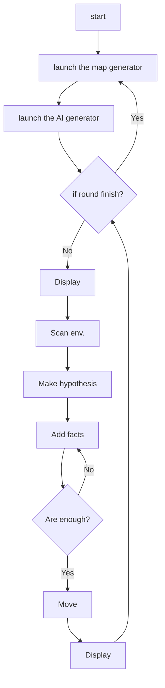

# ia-projet-foret

This repo is for my third project for the AI class in UQAC.

The purpose of this project is to create a program that is capable to make correct action by inference. The PDF request should be available [here](./8INF878%20-%20TP3%20-%202022.pdf)).

## components

As always, several components here:

- `Level`, generation of level, answer the query, interaction with the agent;
- `Agent`, the persona of AI, do the query, try to move on the map;
- `Graph`, `Vertex`, `Edge`, etc. To build the probability graph;
- `Action`, do whatever the persona can do with the map.
- `GUI`, interface.

## language spec

This time I will write in Python, because I like Python, and because I don't want mess with `JavaFX`, or any interface in C. Maybe I can write the engine in C if Python is too slow. The interface will be present in `matplotlib`.

## personal note

To get start, there has been already the details from the subject. I should do it with a reasoning system. A little bit of graph theory. For each situation (with the notion of "knowledge") the AI should generate a whole graph of *hypothesis*. Then it observe the environment, give it an *observation*. Which will change the state, and thus give the best choice from the known situation.

## flow in graph

