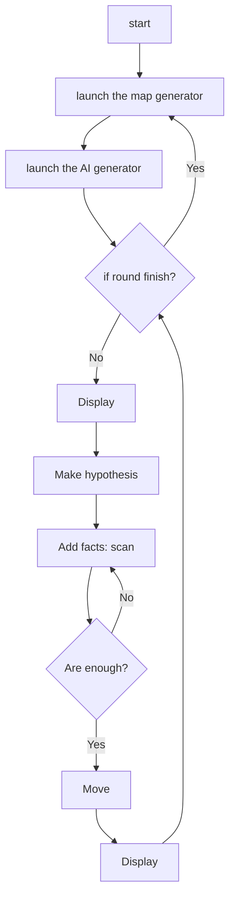

# ia-projet-foret

This repo is for my third project for the AI class in UQAC.

The purpose of this project is to create a program that is capable to make correct action by inference. The PDF request should be available [here](./8INF878%20-%20TP3%20-%202022.pdf)).

## components

As always, several components here:

- `Map`, generation of level, answer the query, interaction with the agent;
- `Agent`, the persona of AI, do the query, try to move on the map;
- `KnowledgeGraph`, build the probability graph.

## language spec

This time I will write in Python, because I like Python, and because I don't want mess with `JavaFX`, or any interface in C. Maybe I can write the engine in C if Python is too slow. The interface will be present in `matplotlib`.

## launch program

Each component can be launched individually, which is served as a basic test of the component. To launch the program as a whole, one should launch the `main.py`. The following command in a shell can launch the program:

```bash
python main.py
```

## personal note

To get start, there has been already the details from the subject. I should do it with a reasoning system. A little bit of graph theory. For each situation (with the notion of "knowledge") the AI should generate a whole graph of *hypothesis*. Then it observe the environment, give it an *observation*. Which will change the state, and thus give the best choice from the known situation.

### flow in graph

(The graph can be shown in `Typora`, which is a markdown editor with extra components.)



### encoding

for each iteration of exploration, we start by giving the analysor a list of coordinates, these are the coordinates with unknown situation: then the program will create an array to represent each possible (or impossible) siutation.

the first step if to establish a given ordre between the lists of 2D coordinates. we use simply the ordre of the input. i.e. we save the list of input in the program as the interface of input and output. for the next, there will be no more `coord (x, y)` but "coord at `index x` of the list".

the second part is to build the actual array with `numpy`. for each coordinate we suppose its status is one of the following four:

- nothing
- monster
- hole
- exit

this makes a unique decl for each assupmtion, with is a set of relationb between `coord1, coord2, ..., coordn` to $\{0, 3\} ^ n$.

so the formula to calculate the `depl` is:

$$
depl = \sum_i {s_i \cdot 4^i}
$$

with $i$ the status of the `coordi`.

### decoding

to decode, we have the status of one coord. the first step is to find the `index`. then we need to get all the item in the table that match this index the its status.

to deal with the higher parts, use a `mod` with $4^{i+1}$, then the lower parts are safely negalted with a `int division`. write this in a seperate function.
